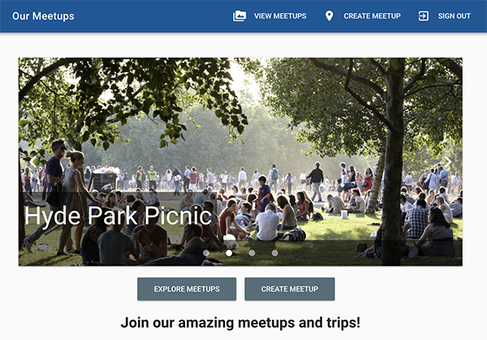

# Meet-up Web App
Exploring events, creating new events only for registered users, signing-up for events.

Web application built using Vue.js + Vuetify and Google Firebase.

Website address: https://hopeful-rosalind-040bf3.netlify.app/



## Build Setup

``` bash
# install dependencies
npm install

# serve with hot reload at localhost:8080
npm run dev

# build for production with minification
npm run build

# build for production and view the bundle analyzer report
npm run build --report
```

For a detailed explanation on how things work, check out the [guide](http://vuejs-templates.github.io/webpack/) and [docs for vue-loader](http://vuejs.github.io/vue-loader).
